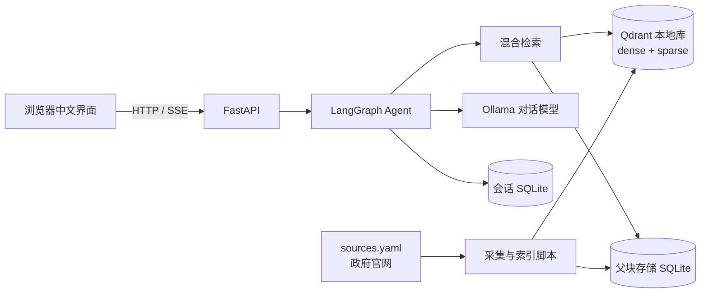
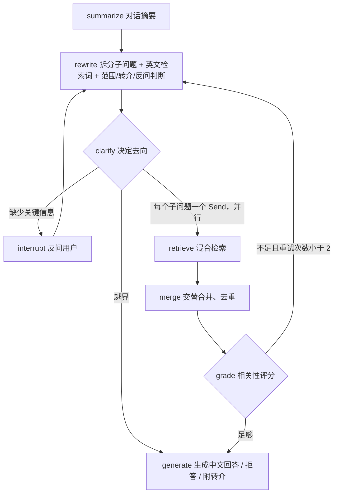

# KiwiGuide：新西兰留学生生活助手

个人项目。一个基于 Agentic RAG 的中文问答助手，帮助在新西兰的国际学生查询以下问题：
- 租房（tenancy）
- 打工与劳动权益（employment）
- 学生签证条件（visa）
- 税务（tax，IRD）

回答只依据新西兰政府官网的内容，每条结论都附编号引用和出处链接。

> 版本 v1.0.0。开发过程见 [PLAN.md](PLAN.md) 和 [开发日志](docs/devlog/README.md)，设计细节见 [docs/design.md](docs/design.md)，评测报告见 [docs/eval.md](docs/eval.md)。

## 功能
- 用中文提问，回答附官方出处（标题、链接、抓取日期）和免责声明；官方术语首次出现时附英文原名
- 缺少关键信息时先反问，例如签证类型、是否在学期中、是正式租客还是合租或寄宿
- 复合问题拆成最多 3 个子问题，并行检索后统一作答
- 检索结果不足时改写检索词重试（最多 2 次）
- 与主题无关的问题礼貌拒答；个案法律或移民问题附上对应机构的转介建议
- 父子分块，稠密向量 + BM25 混合检索，RRF 融合
- 多轮会话记忆（按 thread_id 保存）
- FastAPI 接口（支持 SSE 流式输出）和中文网页界面
- 朴素 RAG 与 Agent 的对比评测

## 架构



Agent 的流程：



## 技术栈
Python 3.12 · uv · FastAPI · LangGraph · Ollama（gpt-oss:120b-cloud、qwen3-embedding:0.6b）· Qdrant（本地模式）· fastembed（BM25）· pytest · GitHub Actions

## 快速开始

以下命令在 Windows、macOS、Linux 上相同（Windows 下用 PowerShell 或 Git Bash）。

### 1. 安装 uv 和 Ollama
- uv：按 [官方说明](https://docs.astral.sh/uv/getting-started/installation/) 安装。uv 会自动准备 Python 3.12，不需要另外安装 Python
- Ollama：从 [ollama.com](https://ollama.com/download) 下载安装，并保持服务运行

### 2. 登录 Ollama 并拉取模型
默认对话模型 `gpt-oss:120b-cloud` 是 Ollama 云模型，需要先登录（免费账号即可）：

```bash
ollama signin
```

拉取向量模型（约 640MB）：

```bash
ollama pull qwen3-embedding:0.6b
```

可选：拉取备用本地模型（约 2.5GB），云模型出错（如额度用完、断网）时自动切换：

```bash
ollama pull qwen3:4b-instruct-2507-q4_K_M
```

### 3. 获取代码并安装依赖

```bash
git clone https://github.com/sxy4556-ai/kiwiguide.git
```

```bash
cd kiwiguide
```

```bash
uv sync
```

配置项都有默认值，不创建 `.env` 也能运行。需要修改模型、数据目录等时，把 `.env.example` 复制为 `.env` 再修改。项目不需要任何 API 密钥。

### 4. 检查环境

```bash
uv run python scripts/check_env.py
```

脚本会检查 Ollama 是否在运行、对话模型和向量模型是否可用，缺少向量模型时自动下载。

### 5. 抓取数据并建索引

```bash
uv run python scripts/fetch_sources.py
```

```bash
uv run python scripts/build_index.py
```

抓取 `sources.yaml` 中的 50 个官方页面。由于遵守各站点的抓取间隔（employment.govt.nz 要求 5 秒），抓取需要几分钟。数据、索引和会话记录都保存在 `data/`，不会提交到仓库。

### 6. 启动服务

```bash
uv run uvicorn app.main:app
```

- 网页界面：http://127.0.0.1:8000/
- 接口文档：http://127.0.0.1:8000/docs

也可以在命令行直接提问（服务运行时不要用，见下方"注意"）：

```bash
uv run python scripts/ask.py "房东最多可以收多少押金？"
```

### 7. 更新数据
官网内容更新后，重新抓取所有来源，只为内容有变化的页面重建索引：

```bash
uv run python scripts/refresh_sources.py
```

服务运行时改用接口 `POST /ingest/refresh`，效果相同。

### 注意
Qdrant 本地库同一时间只允许一个进程打开。服务运行时，不要同时运行 `build_index.py`、`refresh_sources.py`、`ask.py` 或 `run_eval.py`，否则会报存储被占用的错误；先停止服务再运行，或者用对应的接口。

## 接口说明

| 方法与路径 | 说明 |
|---|---|
| `GET /` | 中文网页界面 |
| `GET /health` | 服务状态、版本、Ollama 是否可达（不可达时返回 `degraded`） |
| `POST /chat` | 提问。输入 `question` 和可选的 `thread_id`；返回 `thread_id`、`status`（`answered` 或 `needs_clarification`）、`answer`、`citations`、`clarification_question` |
| `POST /chat/{thread_id}/resume` | 回答反问（输入 `answer`），从断点继续 |
| `POST /chat/stream` | SSE 流式输出，事件依次为 start、progress、token、answer、citations、done；需要反问时发送 clarification，出错时发送 error |
| `GET /sources` | 已索引的来源列表：主题、标题、链接、抓取日期 |
| `POST /ingest/refresh` | 在后台重新抓取并增量更新索引（返回 202；已有任务在运行时返回 409） |
| `GET /ingest/refresh` | 查看更新任务的状态和结果摘要 |

示例：

```bash
curl -X POST http://127.0.0.1:8000/chat -H "Content-Type: application/json" -d "{\"question\": \"学生签证每周可以打工多少小时？\"}"
```

所有错误都返回 `{"detail": "中文说明"}`。Ollama 不可用时问答接口返回 503，`/health` 和首页不受影响。

## 评测结果摘要
在 30 道题（中文 20、英文 10，覆盖四个主题）上对比朴素 RAG 和 Agent，top_k 均为 8。忠实度和正确率由 LLM 评判，1–5 分。

| 指标 | 朴素 RAG | Agent |
|---|---|---|
| hit@5 | 0.967 | **1.000** |
| MRR | 0.894 | **0.900** |
| 忠实度 | 4.73 | **4.77** |
| 正确率 | **4.53** | 4.13 |
| 平均耗时（秒/题，4 题并行） | **8.5** | 19.6 |

- Agent 在检索上更好：改写为英文检索词并按主题过滤后，救回了基线检索不到标准页面的题
- Agent 的正确率低于基线：主要是找到了正确页面但放进上下文的是同一页的其他小节，以及生成时的措辞波动
- 每个配置只运行了一次，平均分 0.2 以内的差异不可靠

详细结果、案例分析和改进方向见 [docs/eval.md](docs/eval.md)。复现评测：

```bash
uv run python scripts/run_eval.py --mode agent
```

## 开发
运行代码检查和测试（测试不访问网络、不调用真实模型）：

```bash
uv run ruff check .
```

```bash
uv run pytest -q
```

## 数据来源与许可
数据来自以下四个政府网站，抓取前已检查各站点的 robots.txt 和版权说明：

| 站点 | 主题 | 页面数 | 许可 |
|---|---|---|---|
| tenancy.govt.nz（Tenancy Services） | 租房 | 15 | Crown copyright，允许个人或非商业用途转载，需注明来源 |
| employment.govt.nz（Employment New Zealand） | 打工与劳动权益 | 14 | Crown copyright，允许个人或非商业用途转载，需注明来源 |
| immigration.govt.nz（Immigration New Zealand） | 学生签证 | 10 | CC BY 3.0 NZ |
| ird.govt.nz（Inland Revenue） | 税务 | 11 | CC BY 4.0 |

仓库只保存来源清单 `sources.yaml`，不保存、不再分发抓取的原文；回答中引用原始链接。详见 [docs/data-sources.md](docs/data-sources.md)。

## 免责声明
本项目提供的信息仅供参考，不构成法律、移民或税务建议。官网内容可能已经更新，回答也可能有误，请以政府官网的最新信息为准，或咨询以下机构：
- Tenancy Services
- Employment New Zealand
- Immigration New Zealand
- Inland Revenue（IRD）
- 社区法律中心（Community Law）
- 持牌移民顾问（licensed immigration adviser）
- 学校的国际学生办公室

## 作者
[sxy4556-ai](https://github.com/sxy4556-ai)
