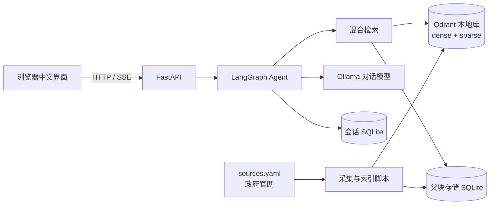
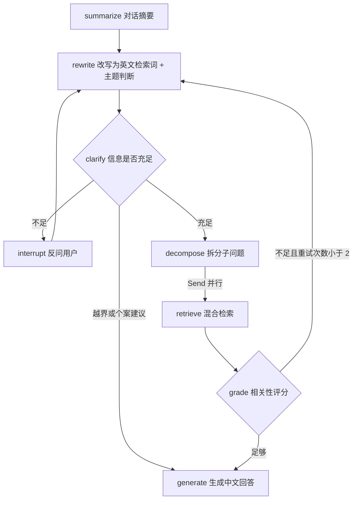

# KiwiGuide 设计文档

## 1. 目标与范围
- **用户**：在新西兰学习和生活的国际学生，主要用中文提问。
- **主题**：
  - 租房（tenancy）
  - 打工与劳动权益（employment）
  - 学生签证条件（visa）
  - 税务（tax）
- **原则**：只依据政府官网内容回答，每条结论都给出处；信息不足时先反问。
- **不做**：
  - 个案法律、移民或税务建议。涉及时只给出官方的一般性信息，并建议联系对应机构或持牌顾问。新西兰对移民建议有执业许可要求。
  - 与主题无关的闲聊。

## 2. 总体架构

## 3. 数据流水线
1. **来源清单**：`sources.yaml` 列出官方页面，字段为 url、topic、title、note。
2. **抓取**（`app/ingest/fetch.py`）
   - 用 httpx 抓取，遵守 robots.txt
   - 同一域名的请求间隔至少 1 秒，失败重试 2 次
3. **清洗**（`app/ingest/clean.py`）
   - 用 trafilatura 提取正文，转成 Markdown，保留标题层级
   - 输出到 `data/processed/<topic>/<slug>.json`，字段为 url、title、topic、retrieved_at、content_hash、markdown
4. **分块**（`app/ingest/chunk.py`）
   - 父块：按 #、##、### 标题切分；超过 2000 字符的按段落再切，少于 200 字符的与相邻块合并
   - 子块：在父块内按约 500 字符、重叠 80 字符切分，优先在句子边界断开
5. **索引**（`app/ingest/index.py`）
   - 子块同时写入稠密向量（qwen3-embedding:0.6b，维度在运行时探测）和稀疏向量（fastembed 的 BM25），存进 Qdrant 本地库 `data/qdrant`
   - 父块存进 `data/parents.sqlite`
   - 按 content_hash 增量更新
6. **数据不入库**：`data/` 已加入 gitignore，仓库只保存来源清单，需要时用脚本重新生成。

## 4. 检索
- **混合检索**：dense 和 sparse 各取 top 20 作为 prefetch，用 RRF 融合后取 top_k（默认 6）。
- **主题过滤**：Agent 判断出主题后，用 payload 中的 topic 过滤。
- **父块回取**：命中的子块按 parent_id 去重，再把对应的父块作为上下文，兼顾检索精度和上下文完整性。

## 5. Agent 设计（LangGraph）

- **显式图**：流程由图控制，不依赖模型原生的工具调用，更换模型时更稳定。
- **结构化输出**：各节点要求模型输出 JSON，用 pydantic 校验；失败时重试一次，再失败就降级。
- **状态**：messages、summary、question、search_queries、topic、sub_questions、retrieved、grade、retries、answer、citations、clarification_question。
- **回答格式**：
  - 中文作答；官方术语首次出现时附英文原名
  - 用 [1][2] 编号引用，并附出处列表（标题、链接、抓取日期）
  - 结尾附免责声明；需要时给出转介建议
- **会话记忆**：SQLite checkpointer，存在 `data/checkpoints.sqlite`，按 thread_id 区分会话。
- **模型**：对话模型用 `LLM_MODEL`（Ollama 云模型，默认 gpt-oss:120b-cloud），调用失败时切换到 `FALLBACK_LLM_MODEL`（本地 qwen3:4b）。备用模型调用时请求关闭思考模式；如果所用的模型版本总是开启思考、无法关闭，退回本地时一次问答仍要几分钟，这时应换用不带思考的 instruct 版本。输出中的思考段（包括只有结尾 `</think>` 的情况）会在解析前去掉。

## 6. API 设计（FastAPI）

| 方法与路径 | 说明 |
|---|---|
| `GET /health` | 服务状态、版本、Ollama 是否可达 |
| `POST /chat` | 提问；返回 thread_id、status（answered 或 needs_clarification）、answer、citations、clarification_question |
| `POST /chat/{thread_id}/resume` | 回答反问，从断点继续 |
| `POST /chat/stream` | SSE 流式输出：节点进度事件、回答文本、引用列表 |
| `GET /sources` | 已索引的来源列表 |
| `POST /ingest/refresh` | 在后台重新抓取并增量更新索引 |
| `GET /` | 中文网页界面 |

## 7. 配置
统一由 `app/config.py`（pydantic-settings）读取 `.env`，各字段见 `.env.example`。项目不需要任何 API 密钥。

## 8. 测试策略
- 测试不访问网络、不调用真实模型。网络请求用离线样例代替，模型用 `tests/fakes.py` 中的假模型。
- 每个测试的文档字符串都写明为什么必须保证这个行为。例如：回答必须带官方链接，因为用户需要自己核实；缺少签证类型时必须反问，因为不同签证的规定不同。
- CI（GitHub Actions）在每次 push 时运行 ruff 和 pytest。

## 9. 评测
- **题集**：`eval/questions.yaml`，共 30 题，中英文混合，覆盖四个主题；每题标注 gold_urls 和 key_points。
- **检索指标**：hit@k、MRR，用代码计算。
- **回答指标**：忠实度、要点覆盖率，由 LLM 评判，1–5 分。
- **对比对象**：朴素 RAG 基线与 Agent，结果写进 `docs/eval.md`。

## 10. 数据许可与合规
- 抓取前检查各站点的 robots.txt 和版权说明，结论记录在 `docs/data-sources.md`。
- 回答中引用原始链接；原始数据不提交、不再分发。
- 界面和每条回答都附免责声明。
